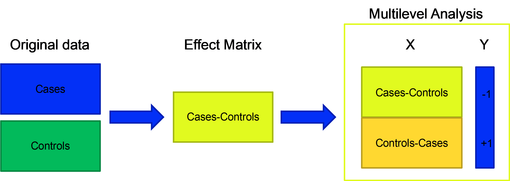

```{r, include = FALSE}
source("_common.R")
```

Both of the other analysis articles assume one sample per individual. When that is
not true, cross-validation will happily put two samples from the same person in
both the training and the test set, and the model will look better than it is.

There are two distinct situations here, and they need different fixes.

## 1. Repeated samples: use `ID`

If the same individual contributed several samples but there is no systematic
effect distinguishing them — e.g. two measurement occasions, both under
free-living conditions — the dependency is a nuisance, not a signal. The fix is to
keep an individual's samples together when the data is split into segments, which
is what the `ID` argument does.

The `freelive` data is `freelive2` with the repeats put back: 112 samples from 58
individuals, with `IDR` saying which sample came from whom.

```{r setup}
library(MUVR2)

data("freelive")

dim(XRVIP)         # 112 samples this time, not 58
length(unique(IDR))
```

The only change to the model call is `ID = IDR`:

```{r fit-id}
regrModel <- MUVR2(X =         XRVIP,
                   Y =         YR,
                   ID =        IDR,   # <- keeps an individual's samples together
                   nRep =      4,     # tutorial uses 35
                   nOuter =    6,     # tutorial uses 8
                   varRatio =  0.75,
                   method =    "PLS",
                   modReturn = TRUE)

regrModel$fitMetric
```

`ID` works with every core method (`MUVR2()` with PLS or RF, and `MUVR2_EN()`) and
with every problem type. If your samples are not independent, use it.

## 2. A systematic within-individual effect: multilevel analysis

Now suppose the dependency *is* the signal: a crossover trial where each subject
received both treatments, or a before/after intervention. Here `ID` alone is not
enough, because the between-individual variation — which is usually large, and
which you do not care about — gets conflated with the within-individual treatment
effect, which is the whole question.

If a standard classification is the multivariate analogue of an unpaired t-test,
multilevel analysis is the analogue of a **paired** one.

(This is unrelated to "multilevel models" in the classical-statistics sense of
random effects. Same word, different thing.)

### Step 1: you build the effect matrix

Multilevel analysis is **not a new modelling algorithm** — it is a preprocessing
strategy. Instead of modelling the two conditions as separate observations, you
collapse each subject's pair into a single within-subject *difference*, the
**effect matrix**:

$$EM = X_B - X_A \qquad \text{(or } EM = \log(X_B / X_A) \text{)}$$

Subtracting a subject's two conditions cancels that subject's own baseline, so the
between-subject variation disappears and only the within-subject treatment effect
is left. **You compute this yourself** — MUVR2 does not; it expects the predictors
you hand it to already be within-subject contrasts.

Because the effect matrix is a *single* contrast per subject, this workflow is for
**paired, two-condition designs**: before vs after, or treatment A vs B in a
crossover. It does not extend to repeated-measures designs with three or more
conditions — there is no single difference to take.

### Step 2: MUVR2 builds the response for you

You pass the effect matrix as `X` with `ML = TRUE`, and **no `Y`**. That last part
puzzles people: every other MUVR2 analysis needs a target, so what is a supervised
learner predicting here?

The biological comparison is *already encoded in the predictors* — it is the
direction of each difference. MUVR2 turns that into an ordinary supervised problem
internally: it stacks the effect matrix on top of its own negation and labels the
two halves −1 and +1 (`R/MUVR2.R`):

```r
X <- rbind(EM, -EM)     # each subject appears twice: the difference and its mirror
Y <- c(-1, +1)          # ... labelled -1 and +1
```

```{r ml-scheme, echo = FALSE, out.width = "100%", fig.cap = "How MUVR2 sets up a multilevel analysis internally. You supply the effect matrix (X_B − X_A); MUVR2 stacks it with its negation and assigns the artificial ±1 response. Figure from the MUVR2 tutorial."}

```

MUVR2 then fits this as a regression towards −1/+1 (you will see the message
`Multilevel -> Regression on (-1, 1)`). Because the two halves are mirror images,
the only thing a model *can* learn is the multivariate direction that consistently
separates a positive treatment effect from a negative one. The variables driving
that separation are those most consistently associated with the treatment effect
across subjects.

**The ±1 response is a mathematical device, not a biological grouping.** It does
*not* stand for treatment groups or phenotypes — that comparison already lives in
the effect matrix. The artificial labels exist only to phrase the estimation as a
task a supervised algorithm (RF or PLS) can solve. This is why you supply no `Y`:
there is no biological outcome left to predict once the contrast is in `X`.

### The data

The `crisp` data is a crossover study: untargeted plasma metabolomics from 21
subjects who each received two different breakfast interventions. `crispEM` is
already an effect matrix — 21 rows, one per individual, 1508 columns of
differences in area-under-the-curve between the two meals.

```{r ml-data}
data("crisp")
dim(crispEM)
```

```{r ml-fit}
MLModel <- MUVR2(X =         crispEM,
                 ML =        TRUE,   # <- multilevel; note there is no Y argument
                 nRep =      4,      # tutorial uses 35
                 nOuter =    6,      # tutorial uses 8
                 varRatio =  0.75,
                 method =    "RF",
                 modReturn = TRUE)
```

```{r ml-metrics}
MLModel$nVar       # variables in the min, mid and max models
MLModel$miss       # misclassified observations
MLModel$ber        # balanced error rate
MLModel$fitMetric  # R2/Q2 of the underlying dummy regression
```

## Reading the multilevel prediction plot

This one deserves care, because it looks like neither the regression plot nor the
classification swimlane.

Internally, MUVR2 models both the effect matrix and its negation, so each of the
21 individuals appears **twice**: once in the top half with an expected dummy value
of −1, once in the bottom half with +1. The decision boundary is at 0.

So: points in the top half should fall left of zero, points in the bottom half
right of zero. Any point on the wrong side of the dashed vertical line is a
misclassification. And this is why `MLModel$miss` reports twice as many misses as
there are misclassified individuals — it counts both halves.

```{r ml-mv, fig.height = 6}
ggplotMV(MLModel, model = "min")
```

## Everything else behaves as usual

The validation plot is read exactly as in the [regression article](regression-pls.html):

```{r ml-val}
ggplotVAL(MLModel)
```

The stability plot gives Q2 (of the dummy regression), misclassifications and BER:

```{r ml-stability, fig.height = 8}
ggplotStability(MLModel, model = "min")
```

And variable ranks come out as the familiar boxplot:

```{r ml-virank, fig.height = 6}
ggplotVIRank(MLModel, model = "min")
```

```{r ml-getvirank}
head(getVIRank(MLModel, model = "min"))
```

## Recap

This article covered the two kinds of sample dependency and their different fixes:

- **Repeated samples with no systematic effect** — a nuisance. Keep each
  individual's samples in the same cross-validation segment with `ID`. This works
  with any core and any problem type.
- **A systematic within-individual effect** — the signal. Reduce each subject to a
  within-subject effect matrix and fit it with `ML = TRUE`. MUVR2 builds the ±1
  response internally and estimates the direction of the common treatment effect,
  for paired two-condition designs.

Both are preprocessing decisions made before the model sees the data; the modelling
itself is the same repeated double cross-validation used throughout MUVR2.
