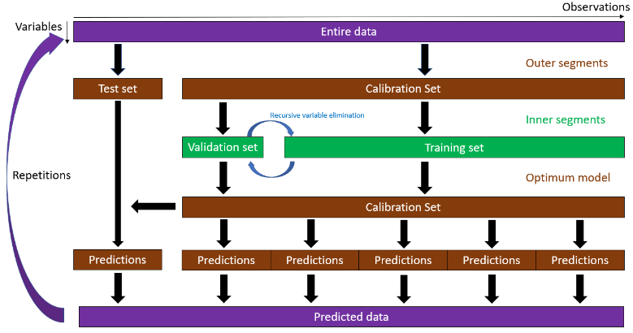

```{r, include = FALSE}
source("_common.R")
```

This article walks through a MUVR2 regression analysis with a PLS core, using the
`freelive2` data: dietary exposure to wholegrain rye, and urine metabolomics, for
58 individuals. The question is which metabolite features predict rye intake.

```{r setup}
library(MUVR2)
library(doParallel)

data("freelive2")
```

`freelive2` loads three objects:

- `YR2`, a continuous target: wholegrain rye consumption for 58 individuals.
- `XRVIP2`, a numeric matrix of 1147 metabolomics features for those 58 individuals.
- `IDR2`, the unique identifier of each individual (used in
  [repeated samples](multilevel.html)).

```{r data}
dim(XRVIP2)
length(YR2)
```

## How MUVR2 works

MUVR2 wraps the core method (PLS, RF or elastic net) in a **repeated double
cross-validation** (rdCV) scheme. The data is split into outer segments; each outer
segment is held out as a test set while the rest is used to tune the model and — for
PLS and RF — to eliminate uninformative variables recursively. The whole procedure
is repeated many times to average out the luck of the split. Every prediction a
MUVR2 model reports comes from a test set that was never seen during its own
training or tuning.

```{r rdcv-scheme, echo = FALSE, out.width = "100%", fig.cap = "The MUVR2 repeated double cross-validation scheme for PLS and RF. Figure from the MUVR2 tutorial."}

```

That machinery is behind the settings below and every plot further down.

## Fitting the model

Three settings drive the algorithm:

- **`nRep`** — how many times the whole double cross-validation is repeated.
  Repetitions cancel out the luck of the draw in how samples land in segments.
- **`nOuter`** — the number of outer cross-validation segments. Usually 6–8; use
  more segments when you have fewer observations, so that more of the data is
  available for training each time.
- **`varRatio`** — the proportion of variables kept at each iteration of the
  recursive variable elimination. Start low (0.6–0.75) for exploration, raise to
  0.8–0.9 for the final model.

For a final analysis you would set `nRep` between 20 and 50 — usually a multiple
of the number of cores — and confirm convergence with `plotStability()`. This
article uses a small model so that the site builds in reasonable time:

```{r fit}
regrModel <- MUVR2(X =         XRVIP2,
                   Y =         YR2,
                   nRep =      4,     # tutorial uses 35
                   nOuter =    6,     # tutorial uses 8
                   varRatio =  0.75,
                   method =    "PLS",
                   modReturn = TRUE)
```

For a real analysis, register a parallel backend first and MUVR2 will use it:

```r
cl <- makeCluster(detectCores() - 1)
registerDoParallel(cl)
regrModel <- MUVR2(X =         XRVIP2,
                   Y =         YR2,
                   nRep =      35,
                   nOuter =    8,
                   varRatio =  0.85,
                   method =    "PLS",
                   modReturn = TRUE)
stopCluster(cl)
```

## What came out

Every MUVR2 model produces three consensus models at once, differing only in how
many variables they use:

- **`min`**, the *minimal-optimal* model: the smallest set of variables that still
  predicts optimally. This is the set you want for biomarker discovery.
- **`max`**, the *all-relevant* model: every variable carrying relevant signal,
  including ones whose information is redundant. This is the set you want for
  biological interpretation.
- **`mid`**: the geometric mean of the two, a middle ground.

```{r metrics}
regrModel$fitMetric   # R2 and Q2 for the min, mid and max models
regrModel$nVar        # number of variables in each
regrModel$nComp       # number of PLS components in each
```

R2 describes how well the consensus model fits the data it was trained on; Q2 is
the cross-validated version, and is the number to trust. A large gap between them
is overfitting.

## Validation: how many variables?

`ggplotVAL()` shows the validation metric (here RMSEP) against the number of
variables surviving the recursive elimination. Light grey lines are individual
inner segments, darker grey lines are those averaged within a repetition, and the
black line is the average over all repetitions. The three vertical lines are the
`min`, `mid` and `max` selections.

The `min` and `max` cutoffs are placed at the outer edges of the region where
validation performance is within a slack allowance (5% by default) of the best
value observed, after rescaling the fitness range to {0, 1}.

These articles use MUVR2's `ggplot2` plotting throughout: the `gg`-prefixed
functions return a `ggplot` object you can theme, save with `ggsave()`, or hand to
`plotly::ggplotly()` for an interactive version. Each has a base-graphics twin
(`plotVAL()`, `plotMV()`, …); the [plot gallery](plot-gallery.html) sets the two
side by side.

```{r val}
ggplotVAL(regrModel)
```

## Predictions

For regression, `ggplotMV()` puts the actual target on the x-axis and the
predictions on the y-axis. Small grey dots are the predictions of individual
repetitions, black dots the consensus — so the spread of grey around each black
dot tells you how much the prediction moved between repetitions.

```{r mv}
ggplotMV(regrModel, model = "min")
```

## Interpreting the PLS model

`ggbiplotPLS()` overlays observation scores and variable loadings from the
consensus PLS fit. Here the samples are shaded by their rye exposure (`xCol = YR2`),
and the labels are suppressed to keep it readable.

```{r biplot}
PLSfit <- regrModel$Fit$plsFitMin

ggbiplotPLS(PLSfit,
            comps =   1:2,
            xCol =    YR2,
            labPlSc = FALSE,
            labPlLo = FALSE)
```

## Was `nRep` high enough?

`ggplotStability()` is the check that tells you whether the model has converged. For
regression it draws three panels, as facets — number of selected variables, the
proportion of them that match the final selection, and Q2 — each as both a
per-repetition series and a cumulative average.

Individual repetitions bounce around, because samples are randomly assigned to
segments. What matters is that the **cumulative** curves have flattened. If they
have not, raise `nRep`. Convergence usually arrives within 20–50 repetitions; this
article's model uses `nRep = 4`, deliberately far short of that, so expect the
curves to still be moving.

```{r stability, fig.height = 7}
ggplotStability(regrModel, model = "min")
```

## Which variables?

`ggplotVIRank()` shows the rank of each variable across repetitions, as a boxplot;
lower is better. Variables inside the selection of `model` are highlighted. A
variable that is consistently ranked low across repetitions is a reproducible
predictor; one whose box is wide is not.

```{r virank, fig.height = 6}
ggplotVIRank(regrModel, n = 20)
```

The y-axis labels are the column names of `X`. In `freelive2` these are LC–MS
feature identifiers that encode each feature's chromatographic mode, *m/z* and
retention time — e.g. `RPX100.0527.1.76` is the reversed-phase feature at
*m/z* ≈ 100.0527 and retention time ≈ 1.76 min. Your own data will carry whatever
names you gave its columns.

The same ranking as a table:

```{r getvirank}
head(getVIRank(regrModel, model = "min"))
```

And the selected variable names:

```{r vars}
head(regrModel$Var$min)
length(regrModel$Var$min)
```

## Next steps

- The model above says nothing about whether this performance could have arisen by
  chance. That is what [resampling and permutation tests](resampling-tests.html)
  are for, and you should run them before believing any of this.
- Random forest is the same call with `method = "RF"`; elastic net is
  [`MUVR2_EN()`](classification-en.html).
- Each of `IDR2`'s individuals contributes one sample here. When individuals
  contribute several, see [repeated samples](multilevel.html).
